# 本节内容
1. 激活函数的作用
2. 分离设计的意义
3. 优秀激活函数的特点
4. 早期函数: 跃阶函数与 Sigmoid
5. ReLU 的突破
6. ReLU 的改进方案
7. 总结

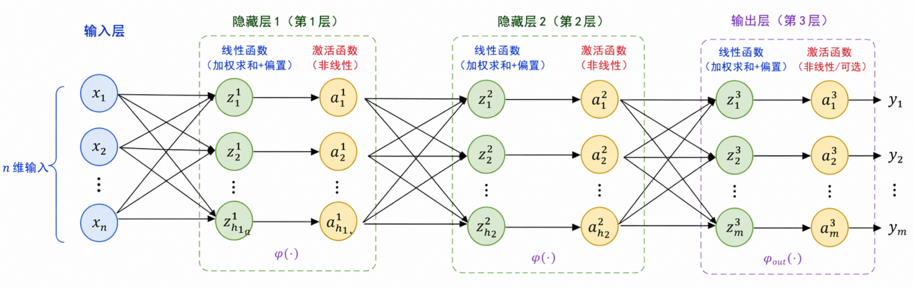

每个神经元做 **两次运算**  
1. 线性组合  
	对输入信息进行加权求和 $z = Wx + b$  
2. 非线性映射  
	处理输出信号 $a = \sigma (z)$  

# 激活函数的作用
假设一个三层神经网络的输出是

$$
y = W_3(W_2(W_1 x + b_1) + b_2) + b_3
$$

展开括号

$$
y = (W_3 W_2 W_1)x + (W_3W_2b_1 + W_3b_2 + b_3)
$$

令 $W' = W_3W_2W_1 \ , \ b' = W_3W_2b_1 + W_3b_2 + b_3$   
上式退化  

$$
y = W'x + b'
$$

在形式上显而易见，无论如何堆叠线性组合，没有激活函数的神经网络模型始终是线性模型

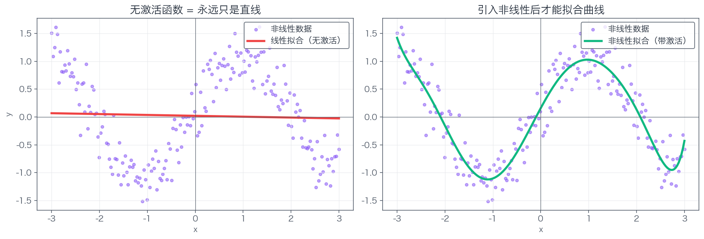

然而现实世界中大多问题是非线性的，猫狗边界并非直线，温度与销量也不是简单正比关系

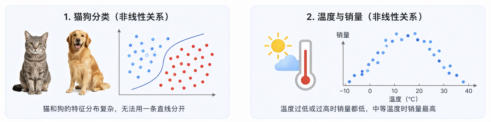

# 分离设计的意义
为何不直接把线性函数做成非线性？

理论上没问题，工程实现上做不到

1. 充分利用线性运算的工程红利,对矩阵乘法 $Wx+b$ 有长期的数值计算工程积累  
   - GPU / TPU 为矩阵乘法量身打造， cuBLAS 在毫秒间完成亿级规模的 $Wx$ 计算
   - 线性函数的梯度计算简单，反向传播仅需一行公式， $\cfrac{\partial(Wx)}{\partial W} = x^T$   
2. 叠加多层强非线性引发数值爆炸  
	以 $z = Wx^2 + b$ 为例，叠加 3 层后有 $y = W_3(W_2(W_1x^2 + b_1)^2 + b_2)^2 + b_3$   
	此时输出已经包含 $x$ 的 8 次方，若推广到 10 层则会达到 1024 次方  
	这种指数级膨胀的次幂会导致 2 种极端  
	- 前向计算中的数值迅速冲向无穷大或因精度不足直接归零，导致模型瘫痪
	- 反向传播中的求导系数极大，梯度失控导致模型无法收敛

为遏制指数级膨胀的传导链，可挑选输出有界或导数温和的激活函数，单独激活非线性  
1. $Sigmoid(x) \in (0,1)$   
2. $Tanh(x) \in (-1, 1)$   
3. $ReLU'(x) = 1 \ ,\ (x>0)$   

二阶神经元、Maxout 等方案尝试糅合线性与非线性，均发现收益与代价不等，数量级的计算复杂度增长仅换来 10% 不到的模型效果提升。因此线性变换与独立非线性激活的分层堆叠，是工程效率与理论简洁之间的折中方案。

# 理想激活函数的特点
1. 非线性  
	**基本门槛**
2. 几乎处处可导  
	**反向传播的基本前提**  
	梯度下降依赖链式法则逐层反向传播，误差与经过的每个激活函数导数相乘。反向传播的顺利进行要求激活函数几乎处处可导。
3. 梯度友好  
	**避免梯度消失或是爆炸**  
	激活函数不仅需要几乎处处可导，其导数的分布与大小也有约束  
	- 避免导数长期接近 0，否则多层连乘后的梯度严重衰减导致消失，阻碍深度网络完成学习过程  
	- 避免导数长期大于 1，否则多层连乘后的梯度极端膨胀导致爆炸，参数发散继而模型无法收敛  
	- 理想的激活函数在主要工作区间内的导数可以稳定在 1 附近  
4. 计算便利  
	**工程的硬约束**  
	在大型神经网络中，激活函数在前向及反向的传播过程中反复调用，因此原函数及导数应该尽量简单  
5. 输出零中心  
	**便于优化**  
	如果激活函数的输出结果整体正偏或负偏，那么逐层接收到的输入会长期保持同号，进而使权重梯度在更新中的方向过于一致，导致优化过程以 Z 字性路径震荡。因此输出接近零中心通常使训练更加顺畅。
6. 单调 / 平滑 / 有界  
	**常见的加分项**  
	- 单调: 更加符合直觉，输入越大，激活越强  
	- 平滑: 利于优化过程，更加方便理论分析  
	- 有界: 使得输出范围可控，提升数值的稳定性

# 阶跃函数
**最朴素的激活函数**  
1958年，罗森布拉特用阶跃函数搭建感知机  

$$
\text{step}(x) = 
\begin{cases}
	1, x \ge 0 \\
	0, x < 0 \\
\end{cases}
$$

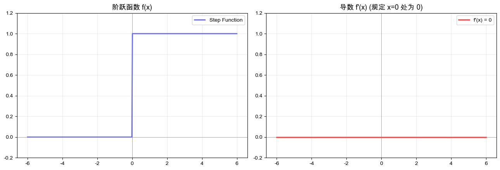

阶跃函数对单层感知机适用，但在多层神经网络中会暴露 2 个根本缺陷  
1. 梯度无法传播  
在 $x=0$ 以外阶跃函数的导数恒为 0，在 $x=0$ 处存在无穷大的跳变，工程中人为规定此处为 0 或忽略不计。  
阶跃函数导数恒 0 意味误差在反向传播时会被清零，梯度无法回流前层，训练无从进行。  
2. 信息损失过大  
输出仅有零一，不能反映对输入数值的程度感知，无法敏感区分信号强弱

阶跃函数的这 2 点缺陷需要更加平滑连续的激活函数完成替代

# Sigmoid
**把开关变成了旋钮**

1986年，辛顿等人将反向传播算法引入神经网络时，沿用了早在19世纪用以描述人口增长的 S 型函数 —— Sigmoid  

$$
\sigma(x) = \cfrac{1}{1+e^{-x}}
$$

函数导数是个简单乘法  

$$
\sigma '(x) = \sigma (x) \cdot (1 - \sigma(x))
$$

函数图形是条 S 形曲线，严格在 0 和 1 之间，是神经网络中最经典的激活函数之一  

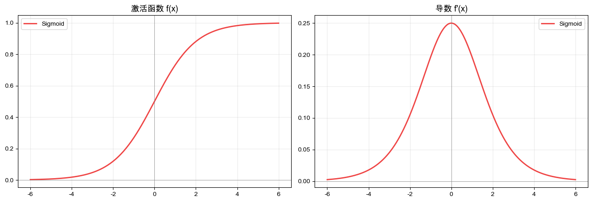

## 优势  
1. 处处可导  
可以完成梯度下降，构成反向传播前提  
2. 输出可控  
	- 输出值域 (0,1) 之间  
	- 在 $x = 0$ 处输出 0.5，可解释为概率 —— 适用二分类输出层  
3. 过渡平滑  
	能够区分输入的微弱差异，神经元具备模拟感  

## 缺陷  
1. 梯度消失  
	当 $|x|$ 变大时，函数两端迅速进入饱和区，导数趋近于0；  
	当 $x=0$ 时 Sigmoid 导数有最大值 0.25。此值经过 5 层网络传播，梯度将会来到 $0.25^5 \approx 0.001$ 。靠近输出层的参数每步都在更新，靠近输入层的参数需要大量步数累积得到相当的变化，即外层在冲刺而内层在踱步。  

2. 输出非零中心  
	Sigmoid 的输出永远是正数。若果某层的输入整体正偏，那么下一层在反向传播时算得的梯度长期同号。这会导致权重更新缺乏灵活性，保持同增或同减，而非各自独立朝最优方向调整。优化器因此难以沿最直接的路径逼近最优解，而是在参数空间里以 Z 形折线震荡。  

3. 计算开销较大  
	Sigmoid 表达式含有指数项，比简单乘法的计算开销高。  
	Sigmoid 通过指数函数将整个实数轴 $(-\infty, +\infty)$ 挤压至区间 $(0, 1)$ 。指数压缩使两端斜率以指数速度衰减，导致饱和现象。

由于前述缺陷， Sigmoid 如今很少用于隐藏层，主要留用于二分类任务的输出层。面对多分类任务，交由 Softmax 完成。

# Tanh  
**把 Sigmoid 摆正了**

1990 年代，贝尔实验室的杨立昆研究手写数字识别时，对 Sigmoid 输出非零中心带来的训练震荡和收敛缓慢感到困扰。 他在 LeNet 系列工作中改用更适合隐藏层的激活函数 —— Tanh (双曲正切)，并在 1998 年的论文 Efficient BackProp 中系统总结函数特点

$$
tanh(x) = \cfrac{e^{x} - e^{-x}}{e^{x} + e^{-x}} = 2\sigma(2x) - 1
$$

函数导数形式简洁

$$
tanh'(x) = 1 - tanh^2(x)
$$

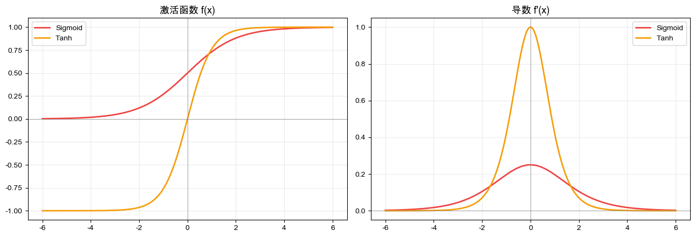

## 改善进步
与 Sigmoid 函数一样，Tanh 函数图形也是 S 形；  
不同的是 Tanh 的输出范围拉伸至 $(-1, 1)$ ，且与 Sigmoid 的关键区别是关于原点对称；  
Tanh 函数解决 Sigmoid 函数作为隐藏层激活函数的 2 个问题。  
1. 缓解梯度消失  
	Tanh 在 $x=0$ 附近的导数最大值为 1，而 Sigmoid 的最大导数仅有 0.25。在反向传播过程中，Tanh 梯度衰减更慢，深层网络的训练会更加容易  
2. 输出零中心  
	Tanh 输出可正可负，下一层神经元接收的输入不会总是同号，梯度方向不易同向。如此缓解 Sigmoid 出现的 Z 字震荡，加快收敛速度  

## 继承旧病
杨立昆基于 Tanh 训练的 LeNet 在手写数字识别上取得巨大成功。到 90 年代末，可由 LeNet 自动识别美国大约 10% 到 20% 的手写支票金额。相当长一段时间里 Tanh 都是神经网络隐藏层的事实标准；  
不过 Tanh 未从根本上解决 Sigmoid 的局限， Tanh 本质是对 Sigmoid 做平移并拉伸， S 形函数的两端饱和问题依旧存在，同时也未解决指数函数的计算开销。  
1. 仍有梯度消失  
	 $|x|$ 变大 $tanh(x)$ 仍会饱和到 $\pm 1$ ，导数趋于 0 ，深层网络学习依旧受阻  
2. 指数计算开销  
	 Tanh 和 Sigmoid 都依赖指数函数，计算成本并未降低，在大规模训练中的负担依旧  

Tanh 只是对于 Sigmoid 做出改良，并非真正意义上的突破。因此当时 CNN 虽能工作，但在训练层仍有局限，深层网络时代的距离尚远  

# ReLU  
2010 年，辛顿等人提出一个极简激活函数 —— ReLU (Rectified Linear Unit)  

$$
\text{ReLU}(x) = max(0, x)
$$

其导数也极其简单  

$$
\text{ReLU}'(x) = 
\begin{cases}
	1, x > 0 \\
	0, x \le 0 \\
\end{cases}
$$

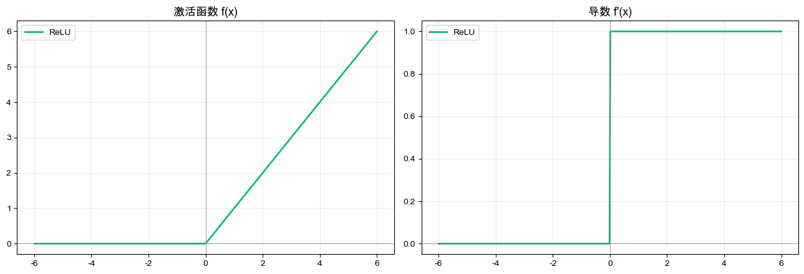

2012 年 ImageNet 竞赛中，辛顿和学生 Alex Krizhevsky, Ilya Sutskever 通过使用 ReLU 作为激活函数的 AlexNet ，在图像二分类任务中以绝对优势胜出，计算机视觉领域迅速转向深度学习。

## 优势  
ReLU 解决多个困扰深层网络的核心问题  
1. 缓解梯度消失  
	ReLU 导数在正半轴上恒为 1 ，在反向传播中梯度几乎保持不变，即梯度几乎不消失；  
	链式法则几乎变成梯度直通车，深层网络首次真正可以训练；  
	ReLu 虽未从理论上彻底解决所有梯度问题，但规避了激活函数本身的大面积梯度衰减。  
2. 减少计算开销  
	ReLU 在前向计算中只需一次简单比较运算，极大节省计算开销。  
3. 天然稀疏激活  
	ReLu 对负输入直接输出 0 ，即在任意前向传播中，只有部分神经元得到激活，其余神经元保持静默；  
	这种稀疏激活与生物神经元放电方式相似，带来一定程度的正则化效果，网络不总启动所有神经元拟合每个样本，进而降低过拟合的风险。  

由于前述优势， ReLU 取代 Sigmoid 和 Tanh ，成为深度学习时代最具代表性的激活函数，作为许多神经网络的默认选择。

## 缺陷  
1. 死亡 ReLU  
	ReLU 在负半轴为零值水平线，导数恒零。因此在参数更新中，若神经元对所有训练样本的预激活值落在负区间，则该神经元输出恒零，导数恒零。在反向传播中该神经元无法获得梯度，失去学习能力类同死亡；  
	当学习率过大，这种现象尤其明显，训练初期可能导致大量神经元的失活。可以看作 ReLU 换取极简高效所付出的代价。  
2. 输出非零中心  
	ReLU 输出非零即正，因此仍有非零中心导致优化过程中的 Z 字震荡；  
	相比 Sigmoid 该问题不严重，综合考虑正半轴上梯度直通车的优势，可以接受如此缺陷。  
3. 输出无上界不可控  
	ReLU 正半轴输出无上界，若网络层数深且参数大，则激活值会持续放大，导致输出方差扩大，引发数值失控；  
	因此 ReLU 深层网络通常搭配 Batch Normalization 等归一化技术，控制每层的激活值保持稳定，防止训练过程失控。  

ReLU 凭借极低计算成本、稳定梯度传播和稀疏激活特性，首次使得深层网络在工程实践中真正可以训练、扩展、落地，成为深度学习历史中的重要转折。

# ReLU变体  
ReLU 取得成功之后，研究者们继续对其改造，避免神经元的死亡，改善曲线平滑。

## Leaky ReLU
为避免 ReLU 在负半轴的完全归零导致神经元的死亡，对其引入一个极小的值  

$$
\text{LeakyReLU}(x)
\begin{cases}
	x, &x>0 \\
	ax,&x\le 0\\
\end{cases}
$$

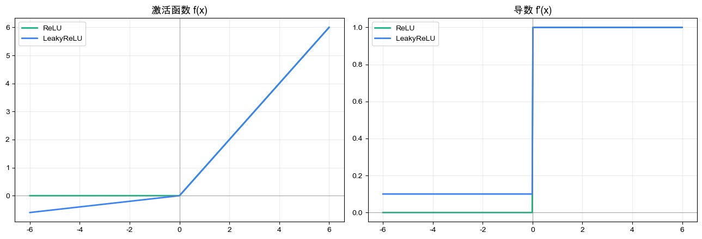

Leaky ReLU 对 ReLU 的负半轴改造为小斜率的上行直线，几乎贴靠 x 轴往左下方缓慢延伸  
如此函数在负半轴不再恒零，导数不再恒零，避免神经元的彻底失活，保留学习能力  
当神经网络在训练过程出现大量神经元的大量死亡，尝试使用 Leaky ReLU 替代 ReLU  
然而 Leaky ReLU 的超参数 $\alpha$ 需要复杂调节取得最优解  
不过经过良好初始化的 ReLU 配合 BatchNorm 基本够用， Leaky ReLU 在工程实践中的提升有限  

## GELU
**Transformer 标配**  

ReLU 在 $x=0$ 处存在硬性切断，输入的负信号会被直接清零，没有任何过渡。

GELU 将硬门替换为软门，根据输入的大小以一定概率决定输出信号  

$$
\text{GELU}(x) = x \cdot \Phi(x)
$$

- $\Phi(x)$ 是标准正态分布的累计分布函数  
- $x$ 越大 $\Phi(x)$ 趋近于 1，几乎通过所有信号  
- $x$ 越小 $\Phi(x)$ 趋近于 0，几乎阻塞所有信号  

$\Phi(x)$ 本身无闭合解析式，在工程中通常使用基于 tanh 的近似式

$$
\text{GELU}(x) \approx 0.5x (1 + tanh [\sqrt{\frac{\pi}{2}}(x + 0.44715x^3)])
$$

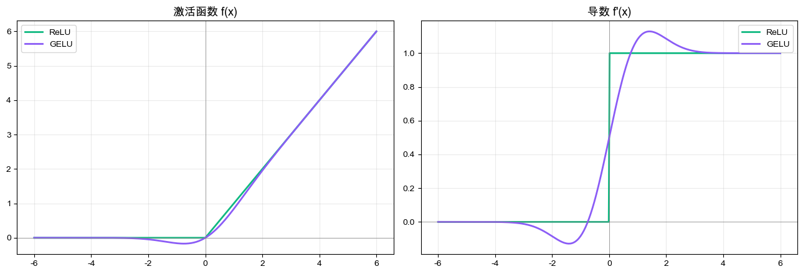

GELU 图像相较 ReLU 更加平滑，在原点处圆滑过渡。在负半轴轻微下凹，最低点在 $x\approx0.75$ 附近取到 $y = -0.17$ ，然后回升趋近于 0。

2018 年， Google 发布的 BERT 论文默认采用 GELU 作为激活函数。此后 GPT 系列、 ViT 以及其他主流 Transformer 类大模型相继跟进。 GELU 在大模型时代的地位，相当 ReLU 之于 CNN 时代的地位。

由于 GELU 需要计算 tanh, 三次方和平方根，因此比计算 ReLU 开销大且速度慢  
在工程实践中，二者的适用场景已相对清晰  
- GELU 成为 Transformer 类大模型 (BERT, GPT, ViT 等) 前馈网络的事实标准  
- ReLU 计算轻量，胜任非 Transformer 类场景 (轻量 CNN, 边缘部署等)  

# Swish / SiLU  
2017年， Google Brain 提出让机器自选激活函数。通过神经架构搜索，让模型从大量候选函数中自动筛选表现最优的函数。结果类似 GELU   

$$
\text{Swish}(x) = x \cdot \sigma (x)
$$

- $\sigma(x)$ 就是 Sigmoid ，函数形式极简，输入乘以经过 Sigmoid 之后的值

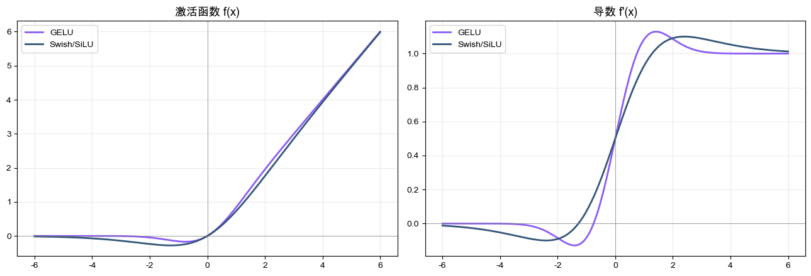

> [!TIP]
> 2016年， Elfwing 等人已经独立提出完全相同的函数，并命名为 SiLU (Sigmoid Linear Unit)  
> 2017年， Google 通过 NAS 重新发现它，并新命名为 Swish  
> 二者本质是相同的函数， PyTorch 中实现该函数的是 `nn.SiLU` ，文档中注明它即为 Swish  

Swish 的图像与 GELU 几乎无二，原点附近平滑过渡，最低点在 $x\approx-1.28$ 附近取得 $y\approx-0.28$ ，随后回升趋近于 0.

Swish 的函数比 GELU 更加简单，仅需 Sigmoid ，计算较为轻松。  
Swish 实际效果整体优于 ReLU ，相当接近 GELU   
因此 Swish 适用多个领域  
- 现代轻量 CNN  
	EfficientNet, MobileNetV3 在精度与速度的权衡中均选择 Swish 作激活函数  
- 大模型前馈层  
	LLaMA 引领诸多开源大模型 Mistral, Qwen, PaLM 等的 FFN 采用 SwiGLU  
- 对计算资源较敏感，并且期望表现优于 ReLU 的场景， Swish 都是高质量的替代选项  

# 总结

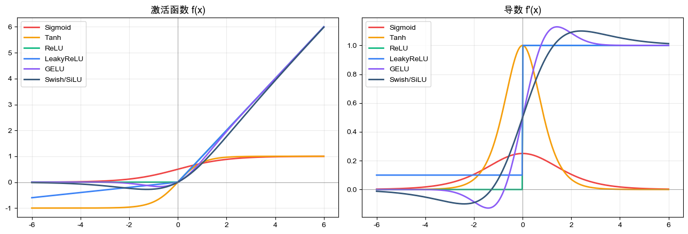

激活函数发展的本质是寻找平衡:   
既要赋予网络非线性表达的能力，又要保证梯度传播、计算便利、训练稳定

- 阶跃函数解决神经元的激活问题，但是不能满足反向传播对曲线平滑或函数可导等要求，同时无法反映输入数值差异，丢失对应信息。因此不适用于深层网络，仅能满足早期感知机的应用；  
- Sigmoid 函数首次将可导的非线性引入神经网络，使得反向传播可以工作，同时天然具有概率解释，因此成为长时间内的隐藏层标准选择。但是 Sigmoid 作为 S 形曲线两端饱和，梯度最大值又太小，输出非零中心，不适用于深层网络开展学习；  
- Tanh 是对 Sigmoid 进行改良，使输出零中心，扩大梯度的最大值，训练优化更加平滑，因此长时间作为隐藏层新的标准选择。但是 Tanh 仍为 S 形曲线，两端饱和及梯度消失的问题未有实质解决；  
- ReLU 是真正的范式转折，通过正半轴恒为 1 的直接方式保留梯度，计算开销极低。 ReLU 使得深层网络首次真正完成训练，开启现代深度学习时代；  
- GELU / Swish 是 ReLU 的变体，保留 ReLU 易训练的优点，改造原点附近折角引入平滑过渡，避免负半轴上神经元的失活。因此在大模型，尤其是 Transformer 中表现更好，但以计算开销增加作为代价

激活函数的演化关键在于平衡非线性表达能力、梯度传播和工程效率。  
如今激活函数的应用格局较清晰:  
- 输出层:  
	概率问题使用 Sigmoid / Softmax
- 普通隐藏层:  
	大多场景适用 ReLU
- Transformer 大模型:  
	GELU / SiLU (Swish)