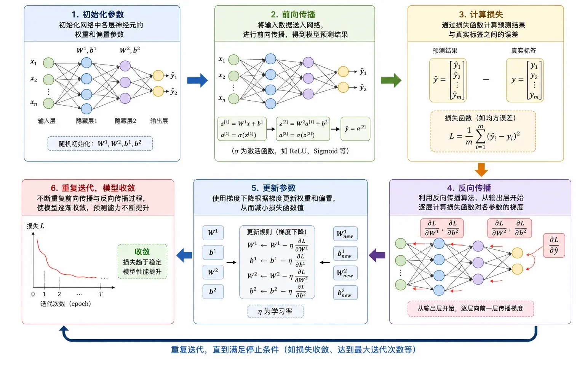
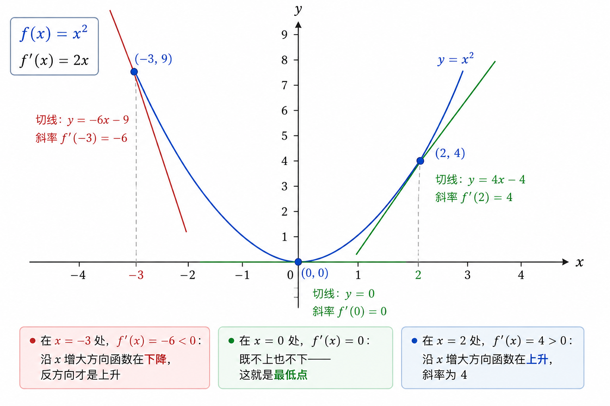
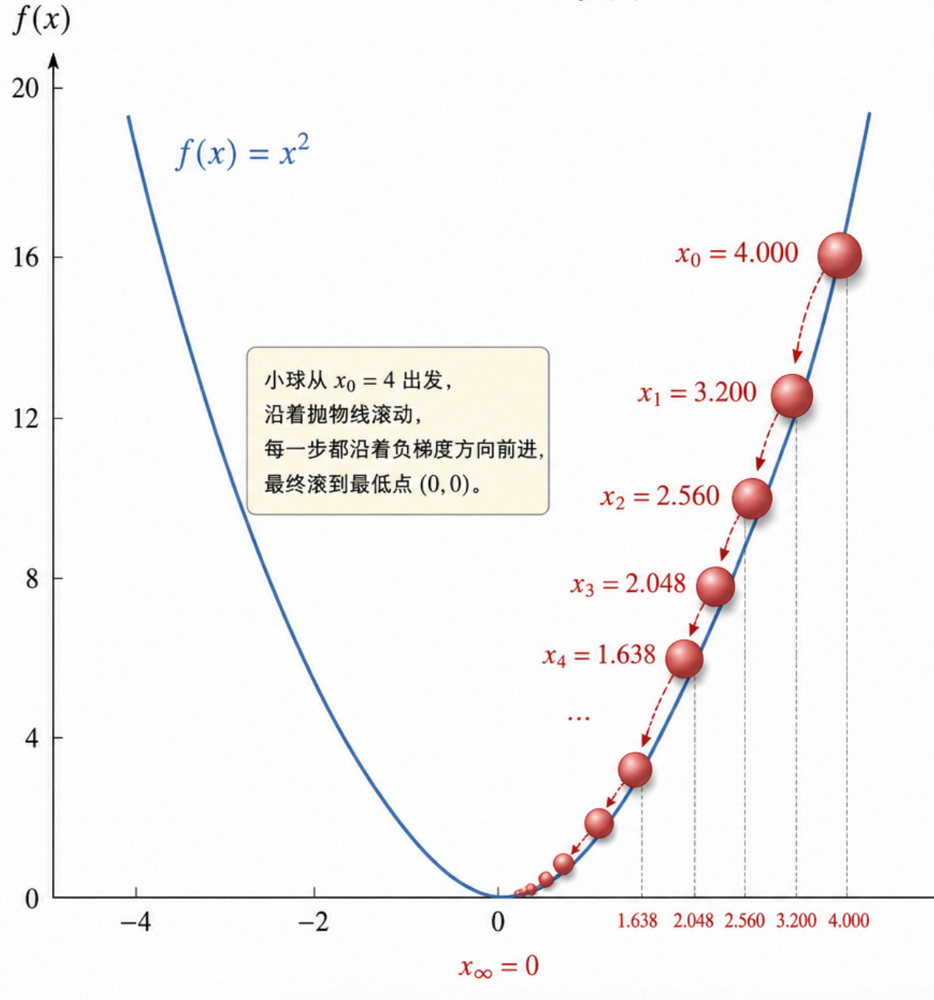
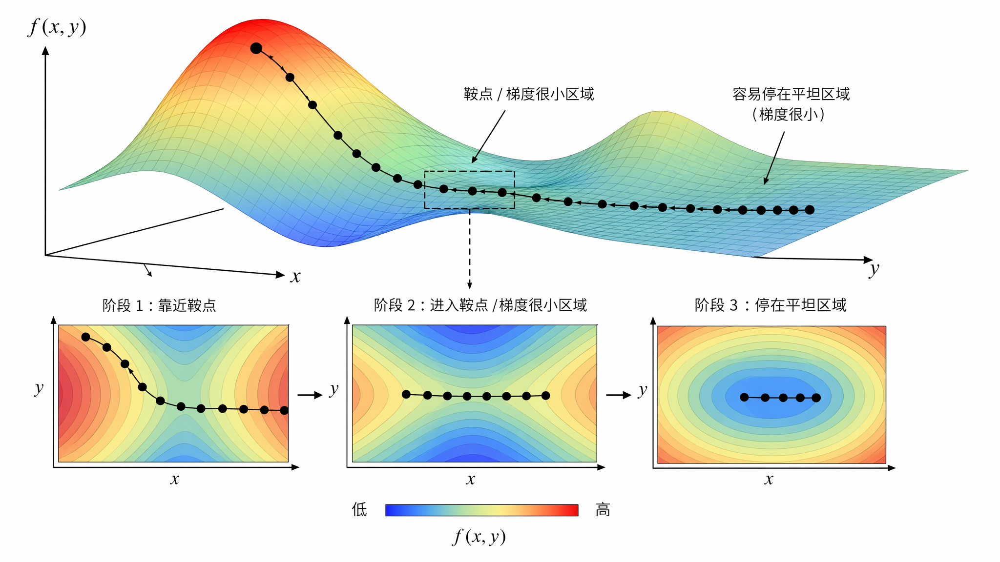
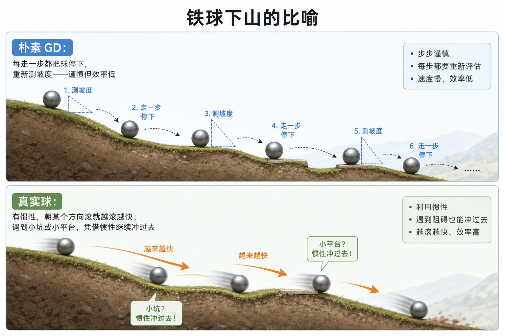
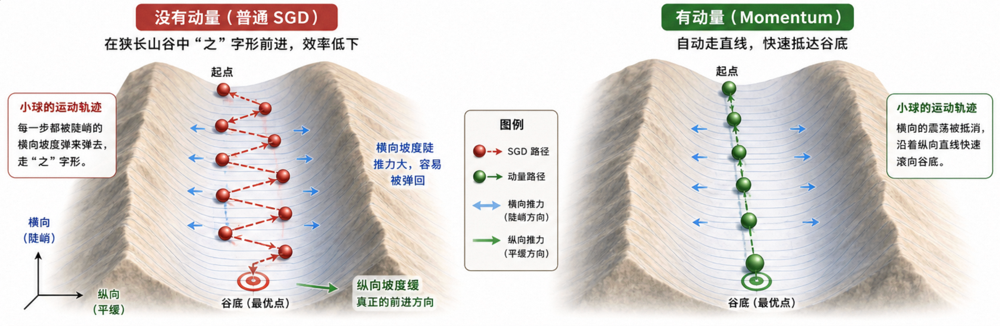

# 本节内容
1. 训练本质: 寻找最优参数
2. 梯度下降原理与类比
3. 梯度下降的朴素问题
4. 优化器演进: SGD 与动量
5. 自适应与组合优化器

# 寻找最优参数
神经网络训练的本质是寻找一组最优参数  

激活函数赋予神经网络 **拟合任意函数的能力**  
神经网络工作首先需要 **确定参数取值**  

神经网络训练在数学上等价于求解:  

$$
\theta^* = \arg \min \limits _\theta L(\theta)
$$

- $\theta$ 是所有参数的集合
- $L(\theta)$ 是损失函数，衡量预测值和真实值的差距

面对神经网络中的海量参数，通过**解析方法**对激活函数求导寻找极值难以实践。因此梯度下降成为神经网络训练替代引擎。  

梯度下降好比以盲目的状态，尝试沿最陡峭的方向小步幅地下山。

# 导数是函数瞬时变化率
通过简单的函数来体会梯度  

## 一维情况
一维抛物线 $f(x) = x^2$  
它的导数是 $f'(x) = 2x$  

- 在 $x = -3$ 处，$f'(x) = -6 < 0$ :  
	沿 $x$ 增大方向函数在下降，沿反方向函数上升  
- 在 $x = 0$ 处，$f'(x) = 0$ :  
	不上不下，此处为最低点  
- 在 $x = 2$ 处，$f'(x) = 4 > 0$ :  
	沿 $x$ 增大方向函数在上升，斜率为 4

导数的切线指向函数上升最快的方向，大小代表上升的速率。  
若使函数自然下降，则沿导数反方向时最快。

## 多维情况
**将偏导打包成梯度**

推广至多维的损失函数 $L(\theta)$  
将函数对每个变量的偏导数组成一个向量，即为**梯度**  

$$
\nabla L(\theta) = [\cfrac{\partial L}{\partial\theta_1},\cfrac{\partial L}{\partial \theta_2},\cdots,\cfrac{\partial L}{\partial \theta_n}]^T
$$

其意义和一维导数完全一样:  
指向 $L$ 在当前点 $\theta$ 上升最快的方向。对其取反，即为损失函数下降最快的方向。

# 梯度下降的工作流程
"沿梯度负方向迈步"以公式表达，即梯度下降的更新规则：

$$
\theta_{t+1} = \theta_t - \eta \cdot \nabla L(\theta_t)
$$

- $\theta_t$ :  
	第 t 步的参数
- $\nabla L(\theta_t)$ :  
	当前位置的梯度方向
- $\eta$ :  
	步长，亦称学习率，控制梯度下降幅度  

## 演示
$f(x) = x^2$ 为例，从 $x_0 =4$ 出发，取 $\eta = 0.1$  

| step | $\bm{x_t}$ | $\bm{f(x_t)}$ | $\bm{f'(x_t)}$ | 更新 | $\bm{x_{t+1}}$ |
| --- | --- | --- | --- | --- | --- |
| 0 | 4.000 | 16.000 | 8.000 | $4.000 - 0.1 \times 8.000$ | 3.200 |
| 1 | 3.200 | 10.240 | 6.400 | $3.200 - 0.1 \times 6.400$ | 2.560 |
| 2 | 2.560 | 6.554 | 5.120 | $2.560 - 0.1 \times 5.120$ | 2.048 |
| 3 | 2.048 | 4.194 | 4.096 | $2.048 - 0.1 \times 4.096$ | 1.638 |
| ... | ... | ... | ... | ... | ... |
| $\infty$ | 0 | 0 | 0 | — | 0 |

观察 3 个关键现象：
- **自带刹车**  
	越靠近最低点，梯度越小，**步长自动变小** —— 梯度下降天然带着一个刹车  
- **单调下降**  
	每一步都比上一步 **更接近0**，函数值单调下降
- **永远逼近**  
	永远到不了 0，只能**无限逼近** —— 所以工程上需要 "差不多就停" 的停止条件

将这套流程应用至真实神经网络，仅需对维度作推广:  

- $\theta$ 是 **所有参数的集合** (亿维向量)  
- $\nabla L(\theta)$ 是 $L$ 对每个参数的偏导构成的向量，通过 **反向传播** 计算  
- $\theta_{t+1} = \theta_t - \eta \cdot \nabla L(\theta_t)$ **更新规则不变**  

> [!TIP]  
> 此处 $\eta$ 是整个训练过程中最敏感的超参数  
> 太大会震荡甚至发散，太小则进展缓慢  
> 后有专门一节展开，目前仅作认识，了解不同优化器对其的巧妙设计  

# 优化器的演进
更新公式的形式简洁  

$$
\theta_{t+1} = \theta_t - \eta \cdot \nabla L(\theta_t)
$$
但在真实的深度学习场景，出现 4 个问题：

1. 在一次更新中是否使用全部样本？
2. 在更新过程中参数震荡如何处理？
3. 不同参数对学习率的敏感度差异巨大，是否由其 **各自调整**？
4. $\eta$ 是否随训练过程 **自动调整**？

> [!TIP]
> 梯度下降优化器的演化主要围绕更新公式回答如下问题  
> 1. 如何计算梯度 (Batch / SGD / Mini-batch)  
> 2. 如何调整步幅 (Momentum)  
> 3. 如何分配学习率 (AdaGrad / RMSProp / Adam / AdamW) 

下文沿时间线介绍每代优化器解决什么问题

## 朴素梯度下降（Batch GD）
> [!TIP]
> 此处 Batch 指在每次更新参数前，先完整处理一遍训练集

1847 年，法国数学家柯西在研究彗星轨道时，最早提出梯度下降思想  
面对六个未知数和一组高度非线性的方程，无法解析求解，只能沿目标函数下降最快的方向逐步逼近答案

将该思路代入机器学习:  
在每次更新参数时，都使用全部训练样本来计算梯度，得到最经典的梯度下降形式：批量梯度下降(Batch Gradient Descent, Batch GD）

$$
\theta_{t+1} = \theta_t - \eta \cdot \frac{1}{N}\sum_{i=1}^{N} \nabla L_i(\theta_t)
$$

- $N$ :  
	是整个训练集的样本数量  
- $L_i$ :  
	是第 $i$ 个样本上的损失;  
	即第 $t$ 次更新参数时，模型遍历整个训练集，算得所有样本损失的平均梯度，再执行更新。

**优势**

- **方向准确、更新稳定**:  
	每步都沿着全数据上的真实梯度前进，梯度估计几乎没有随机噪声，优化轨迹通常比较平滑  
- **理论性质好**:  
	在凸优化问题中，结合适当的学习率，通常保证收敛  

**代价**

- **训练成本高**：  
	每次参数更新需要遍历全部训练数据，大型数据集的计算开销沉重  
- **缺乏随机性**:  
	当优化过程进入鞍点或梯度很小的区域时，Batch GD 往往缺乏噪声扰动帮助跳出局部最优  

Batch GD 是用计算开销换取精确稳定的梯度方向，适用小规模数据集和经典凸优化场景  
在现代深度学习中，随着数据和模型规模迅速增大，Batch GD 效率有限，于是由 SGD 和 Mini-batch SGD 取代

## 随机梯度下降 SGD
**用噪声把训练救活**  
1951 年，北卡罗来纳大学统计学家研究随机问题时，提出随机逼近的思想。  
其核心朴素理念为:  
每次只取一个带噪声的样本做一次小幅的调整，长期重复逼近真实答案。

将该思想代入机器学习，形成随机梯度下降（Stochastic Gradient Descent，SGD）

$$
\theta_{t+1} = \theta_t - \eta \cdot \nabla L_i(\theta_t), \quad i \sim \text{Uniform}(1, N)
$$

即第 $t$ 次更新参数时，不通过整个训练集算得平均梯度，而是随机抽取一个样本，用其梯度作对整体梯度的估计。

**优势**  
相比 Batch GD，每步只用一个样本，产生如下轻量化的优势：

- **计算成本骤降**：  
	每次更新参数的复杂度从 $O(N)$ 降到 $O(1)$，训练效率得到提升  
- **跳出局部最优**:  
	单样本的梯度带有天然噪声，这种随机扰动可以帮助模型跳出鞍点或浅层局部最优  
- **支持在线学习**:  
	适合流式数据场景，可以逐条输入样本，一边接收数据一边更新模型  

**代价**

- **更新轨迹剧烈震荡**:  
	单样本梯度的方差很大，参数在最优点附近不断震荡，难以稳定收敛  
- **学习率需要衰减**:  
	如果学习率固定，那么参数可能保持震荡；
	若果学习率衰减过快，那么参数可能过早停在次优位置  
- **对离群样本敏感**:  
	一个异常样本可能导致参数大幅偏离  

以单样本估计全数据集梯度，本身就是高方差的操作  
噪声既是救命稻草，也是隐患来源  
它能帮助模型跳出局部最优，也能阻碍收敛

> [!TIP]
> 如今少有使用纯单样本 SGD 作为最终训练方式  
> 但是"用随机子样本近似全样本梯度"已成现代深度学习优化方法的基石，后续的优化器基本由此框架演化

## 小批随机梯度下降 (Mini-batch SGD)
**工程上的甜点**  
90 年代，研究者意识到现实问题:  
单样本的梯度收敛震荡，全样本的梯度计算缓慢  

为此出现折中方案:  
每次随机抽取一小批样本 (326/64/128/256) 来计算梯度，既保留适当噪音，又控制计算成本。

$$
\theta_{t+1} = \theta_t - \eta \cdot \frac{1}{B}\sum_{i \in \mathcal{B}_t} \nabla L_i(\theta_t)
$$

- $\mathcal{B}_t$ :  
	是第 $t$ 步随机抽取的小批样本  
- $B$ :  
	是第 $t$ 步随机抽取的样本数量  

**优势**  
Mini-batch SGD 的优势体现在两个层面：统计效率和计算效率

- **方差显著降低**  
	多个样本的梯度在 batch 内求平均，随机噪声大约按 1/B 的比例下降，比单样本 SGD 稳定  
- **GPU 友好**  
	batch 内样本可以并行执行前向和反向传播，充分利用向量化和并行计算能力，这是其在深度学习时代的关键优势  
- **保留适度随机性**  
	相比 Batch GD，Mini-Batch 仍有一定噪声帮助跳出局部最优；  
	相比 单样本 SGD，Mini-Batch 不会剧烈震荡  

**代价**  

- **Batch size 成为关键超参数**  
	若 Batch size 过小，则噪声相对大且收敛慢；  
	若 Batch size 过大，则类似 Batch GD，梯度过于精确，损失泛化能力  
- **大 batch 需要匹配更大学习率**  
	否则每次更新幅度过小，等价于有效训练步数不足  
	因此大规模训练中常采用学习率预热、线性放大学习率等技巧  

> [!TIP]  
> Mini-batch SGD 在统计效率 (降低梯度方差) 与计算效率 (利用硬件并行计算) 之间找到极具工程价值的平衡点  
> 在如今深度学习语境中，SGD 默认是指 Mini-batch SGD。它已成现代神经网络训练的基础框架，几乎所有优化器都由其演化  

## 动量梯度下降 Momentum
**给梯度下降装上惯性**  
1964 年，苏联数学家 Boris Polyak 在研究数值分析中迭代法的收敛速度时，提出动量法  
其核心思想是:  
不仅关注当前梯度，还要考虑过去几步的运动趋势。  
对方向一致的更新持续强化，反复震荡的更新则会被逐步抵消。  

在梯度下降过程中，即使遇到小平台，也可能凭借惯性冲过去。

Momentum 正是把这种惯性引入优化过程：

$$
\begin{aligned}{c}
v_{t+1} = \beta v_t + \nabla L(\theta_t)\\
\theta_{t+1} = \theta_t - \eta \cdot v_{t+1}\\
\end{aligned}
$$

- $v_t$ :  
	可以理解为速度，本质上是梯度的指数滑动平均
- $\beta$ :  
	是动量系数，通常取 0.9 左右。

**优势**  
Momentum 的作用主要体现在以下几个方面：

- **加速一致方向上的前进**:  
	如果连续几步梯度方向相近，那么速度项 $v_t$ 会不断累积  
	参数在该方向更新变快，显著提升收敛速度  
- **抑制震荡方向上的摆动**:  
	Momentum 会让相反方向的更新彼此抵消，从而减小震荡  
	将更多更新量留给实际有效的前进方向
- **帮助穿越浅鞍点与平台区**:  
	即使某一时刻梯度暂时变小甚至接近 0，凭借之前积累的速度，参数仍可继续更新一定幅度，避免立即停止  

**代价**  

- **可能更新过头**:  
	当参数接近最优点而速度项仍然较大时，参数更新可能越过最低点，之后再次折返，产生最优点附近的小幅震荡  
- **对动量系数有一定敏感性**:  
	若 $\beta$ 太小，则积累效果不明显  
	若 $\beta$ 太大，则系统可能迟钝甚至失控  
	虽然默认值 0.9 在实践中普遍稳定适用，但在极端任务仍需调节  

Momentum 的本质是利用历史梯度累积速度，在正确方向上加速，在震荡方向上减速。它极大改善了 SGD 的优化效率，因此在现代深度学习中几乎已成默认配置。

如今大多 SGD 训练默认附带 Momentum  
在 PyTorch 中 `torch.optim.SGD(momentum=0.9)` 基本成为业界和学界的普遍标准设置  
尤其在 CNN 时代，像 VGG、ResNet 等经典模型的大规模训练，核心方案基本都是 Mini-batch SGD + Momentum。

## 自适应梯度下降 AdaGrad
**每个参数有自己的学习率**  
2011 年斯坦福大学的 John Duchi 等人在研究在线学习与稀疏数据问题时，提出了 AdaGrad (Adaptive Gradient Algorithm)  
它的出发点很朴素：  
不同参数的梯度大小差异悬殊，用同一个学习率来更新所有参数过于简单粗暴。

在自然语言处理等场景里，这个问题尤其突出:  
高频词如 "the" 几乎出现在每个 batch ，对应的参数梯度很大，更新已经很充分；  
低频词如 "serendipity" 在训练过程中出现寥寥无几，对应的参数梯度极小。若使用和高频词相同的学习率，对低频词的学习进展缓慢。

AdaGrad 的解决思路是：  
为每个参数单独维护一个历史梯度积累量，用它来自适应地调整对应参数的有效学习率

$$
\begin{aligned}{c}
	G_t = G_{t-1} + \nabla L(\theta_t)^2 \quad \text{（逐元素平方累加）}\\
	\theta_{t+1} = \theta_t - \frac{\eta}{\sqrt{G_t} + \epsilon} \cdot \nabla L(\theta_t)\\
\end{aligned}
$$

- $G_t$ :  
	记录了该参数从训练开始到第 t 步的梯度平方累积和
- $\epsilon$ :  
	是一个很小的常数，防止分母为零
- $\eta / (\sqrt{G_t} + \epsilon)$ :  
	每个参数的有效学习率

1. **梯度大、更新频繁的参数**  
	$G_t$ 积累得很大，有效学习率随之缩小——避免更新过度  
2. **梯度小、更新稀少的参数**  
	$G_t$ 积累得很小，有效学习率保持较大——保证对参数能够被充分学习  

自适应学习率的核心思想:  
对历史更新多的参数降速，对历史更新少的参数提速  

**优势**  

- **告别手动调节学习率**:  
	不同参数的有效学习率由历史梯度自动决定，对全局学习率的敏感性大幅降低  
- **天然适合稀疏数据**:  
	低频特征的参数不会因为梯度小被忽视，在 NLP 和推荐系统中效果尤其显著  

**缺陷**  
AdaGrad 有致命的结构性缺陷——学习率单调递减，且不可逆  
$G_t$ 只增不减，随着训练推进分母不断增大，每个参数的有效学习率只会不断减小，最终趋近于零。模型尚未充分收敛就已动弹不得。  
这个问题在训练深层网络时尤其明显，往往还没到最优点，学习就提前停滞了。

该缺陷直接催生后来的 RMSProp 和 Adam，它们的核心改进都指向同一件事：不要让历史梯度无限积累，而是只保留近期梯度的影响。

## RMSProp
**用滑动平均修补 AdaGrad**  

2012 年 AlexNet 引爆深度学习后，网络层数加深，训练时间加长，迫切需要比 AdaGrad 更适合长期训练的自适应优化方法。

AdaGrad 的思路本身没有问题，但分母里的梯度平方只增不减，使得有效学习率不可逆地缩小，最终趋近于 0。模型尚未真正收敛，几乎完全失去更新幅度。

RMSProp 的核心思想非常直接:  
不要把训练以来的所有梯度平方都加起来，只保留近期的梯度信息。

> [!TIP]
> 有意思的是，RMSProp 并不是以一篇正式论文的形式出现的。它最早来自 Geoffrey Hinton 2012 年在 Coursera 课程 Neural Networks for Machine Learning 的一组讲义幻灯片。Hinton 自己也说过，他当时只是觉得这个改进显然合理，并没把它当成一篇值得发表的工作。但后来全世界做深度学习的人引用 RMSProp 时，最规范的写法竟然就成了 _Hinton, slides of lecture 6e, Coursera, 2012_——一个写在 PPT 里的算法就这样成了主流。

RMSProp 的公式如下：

$$
\begin{aligned}{c}
	E[g^2]_t = \beta E[g^2]_{t-1} + (1 - \beta) \nabla L	(\theta_t)^2\\
	\theta_{t+1} = \theta_t - \frac{\eta}{\sqrt{E[g^2]_t} + \epsilon} \cdot \nabla L(\theta_t)\\
\end{aligned}
$$

- $E[g^2]_t$ :  
	表示梯度平方的指数滑动平均
- $\beta$ :  
	通常取 0.9
	
RMSProp 和 AdaGrad 唯一的形式差别是:  
分母部分使用"梯度平方的指数滑动平均"替代"梯度平方累积和"  
正是这个简单改动，解决 AdaGrad 最致命的问题  

**优势**  

- **避免学习率衰减到 0**:  
	滑动平均会逐渐遗忘久远的梯度，分母不再无限膨胀，避免有效学习率不可逆地趋于零  
- **保留自适应学习率的优势**:  
	每个参数仍有单独的更新尺度  
	梯度大变化快的参数自动缩小更新幅度  
	梯度小或稀疏的参数保持较大更新幅度  
- **更适合非平稳目标**:  
	深度学习中的 loss 曲面会随着训练不断变化，RMSProp 只关注近期梯度，因此比 AdaGrad 更能适应这种动态环境  

**缺陷**  

- **缺少动量信息**  
	只用梯度的**二阶矩**(梯度大小)，没有利用**一阶矩**(梯度前进方向)
	因此它仍可能出现震荡，收敛路径不如带动量的方法平滑  
- **多一个超参数** $\beta$  
	虽然实践中 0.9 已经足够好用，但本质上仍然增加了调参空间。

RMSProp 在训练 RNN 时尤其受欢迎。RNN 的损失曲面通常更加崎岖复杂，AdaGrad 有效学习率不断衰减的特点难以接受  
RMSProp 通过抓近放远缓解这一缺陷，一度成为循环神经网络训练的常用选择，直到 2015 年 Adam 出现。

## Adam 与 AdamW
**把动量和自适应学习率合体**  
至 2014-2015 年，深度学习的优化方法逐渐形成了两条清晰的思路：

- AdaGrad 和 RMSProp 路线:  
	利用梯度**平方的二阶信息**，为不同参数自适应地调整学习率  
- Momentum 路线:  
	利用历史梯度的**一阶信息**，积累速度，在一致方向加速，在震荡方向减速  

2014 年， Diederik Kingma 和 Jimmy Ba 提出 Adam (Adaptive Moment Estimation) 取二者的所长。Adam 同时维护梯度的一阶矩和二阶矩，既有方向感，又有步长感：

$m_t = \beta_1 m_{t-1} + (1 - \beta_1) \nabla L(\theta_t)$

$v_t = \beta_2 v_{t-1} + (1 - \beta_2) \nabla L(\theta_t)^2$

$\hat{m}_t = m_t / (1 - \beta_1^t), \quad \hat{v}_t = v_t / (1 - \beta_2^t)$

$\theta_{t+1} = \theta_t - \eta \cdot \hat{m}_t / (\sqrt{\hat{v}_t} + \epsilon)$

- $m_t$ :  
	是梯度的滑动平均 (一阶矩，对应 Momentum 的速度)  
- $v_t$ :  
	是梯度平方的滑动平均 (二阶矩，对应 RMSProp 的自适应缩放)  
- $\beta_1, \beta_2$ :  
	通常分别取 0.9 和 0.999  
- $\hat{m}_t, \hat{v}_t$ :  
	**偏差校正（bias correction）**  
	因为 $m_0, v_0$ 初始化为 0，训练伊始 $m_t, v_t$ 会偏向 0，导致前几步的更新被严重低估  
	除以因子 $(1 - \beta^t)$ 消除初始偏差，规正训练初步尺度  

**优势**  
把两件事合到一起后，Adam 的表现非常惊艳：

- **如同 Momentum 引入惯性**:  
	参考历史梯度让更新方向更平滑，不容易被局部噪声带偏  
- **如同 RMSProp 自适应缩放**:  
	为每个参数单独定制步长，频繁更新的参数自动收缩，稀疏的参数保持稳健  
- **偏差校正保证训练初期稳定**:  
	避免冷启动阶段的步长过小，使模型训练自伊始就能高效推进  

Adam 具备极强的开箱即用性，收敛飞快，对初始学习率的要求低。它几乎长期成为所有开发者首选的默认优化器。

**缺陷**  
随着研究发现 Adam 存在缺陷：它的权重衰减 (Weight Decay) 失效。

在传统的 SGD 中，权重衰减和 L2 正则化在数学上是等价的，所以早期的 Adam 实现就直接把 L2 项加进了梯度。  
但在 Adam 自适应优化器里，这种做法会使本该起稳定作用的正则信号被自适应机制一同缩放，导致梯度大的参数衰减不足，梯度小的参数被过度衰减，正则化的效果完全偏离原意。

2017 年，Ilya Loshchilov 等人提出 **AdamW**，拆分梯度更新和权重衰减：

$$
\theta_{t+1} = \theta_t - \eta \left( \hat{m}_t / (\sqrt{\hat{v}_t} + \epsilon) + \lambda \theta_t \right)
$$

新增的 $\lambda \theta_t$ 项是直接作用在参数上的权重衰减，不再沿着梯度通道运行，避免被自适应学习率机制污染。

这个细微的修正带来巨大的工程收益  
在 Transformer, BERT, ViT 等大语言模型中，AdamW 基本成为事实标准，奠定如今常见顶尖模型的底层基础。

# 总结
梯度下降优化器的每次演化，都为解决同个问题：参数更新如何稳定快速？

- **Batch GD**  
	奠定梯度下降的基本框架，方向精确但计算开销过高；
- **SGD**  
	用单样本估计换取训练速度，伴随较大不确定性；
- **Mini-batch SGD**  
	在统计效率和计算效率之间取得工程甜点；
- **Momentum**  
	引入惯性，缓解震荡、加速收敛；
- **AdaGrad**  
	为每个参数独立维护学习率；
- **RMSProp**  
	用滑动平均修复 AdaGrad 学习率衰减至 0 的问题；
- **Adam**  
	把动量和自适应步长合体，并用偏差校正保证训练初期稳定；
- **AdamW**  
	进一步把权重衰减从自适应机制中解耦，成为现代训练范式的事实标准

到今天不同的优化器在不同领域发挥着作用

- **CV 任务** :  
	在大多视觉模型中，尤其是卷积网络，SGD + Momentum 配合精心设计的学习率调度，最终精度往往仍然优于 Adam 系方法  
- **NLP/大模型** :  
	基本使用 AdamW，从 BERT, GPT, LLaMA 到 Stable Diffusion，已成现代大模型训练的默认配方  
- **快速试验与原型验证** :  
	Adam 是最省心的起点，通过默认学习率常能得到良好的 baseline  
- **稀疏特征、在线学习、短周期训练** :  
	AdaGrad 依然沿用，在广告 CTR, 传统 NLP 等场景中仍有实际价值  
